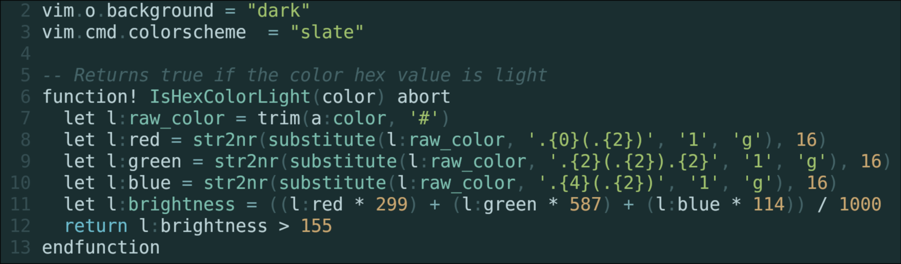

# slate.nvim
A muted teal Neovim colorscheme. 



## Install
To use, simply include it with your package manager of choice. For Neovim 0.11+:
```lua
vim.pack.add({
    { src = "https://github.com/thomas-boyko/slate.nvim" },
})
```

In your config:

```lua
vim.cmd('colorscheme slate')
```
